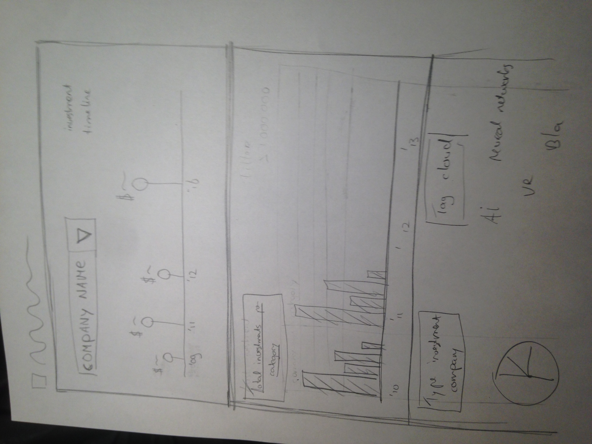

# programmeertraject
|:)

## Project proposal 

Voor mijn opdracht wil ik graag een dataset visualiseren die informatie geeft over nieuwe bedrijven a.k.a. start-ups. De bedoeling is om meer inzicht te krijgen in de ontwikkeling van de markt en in welke technologiën en gebieden wordt geinvesteerd en waar bijvoorbeeld de grote bedrijven in investeren. 

Dataset:
Er zijn veel datasets op internet beschikbaar met informatie over start-ups, veelal betaald. Heb nog geen gratis dataset gevonden. 

Features:
- Tijdlijn met investeringen per bedrijf. Verschillende kleuren voor verschillende categoriën. 
- Totaal investeringen histogram per categorie per jaar
- Tag cloud met meest voorkomende keywords

Problems which may arise:

- dataset not sufficient enough, missing data. 

MVP:
- Atleast a timeline with investment done per company (big ones probaly have multiple investment). 

